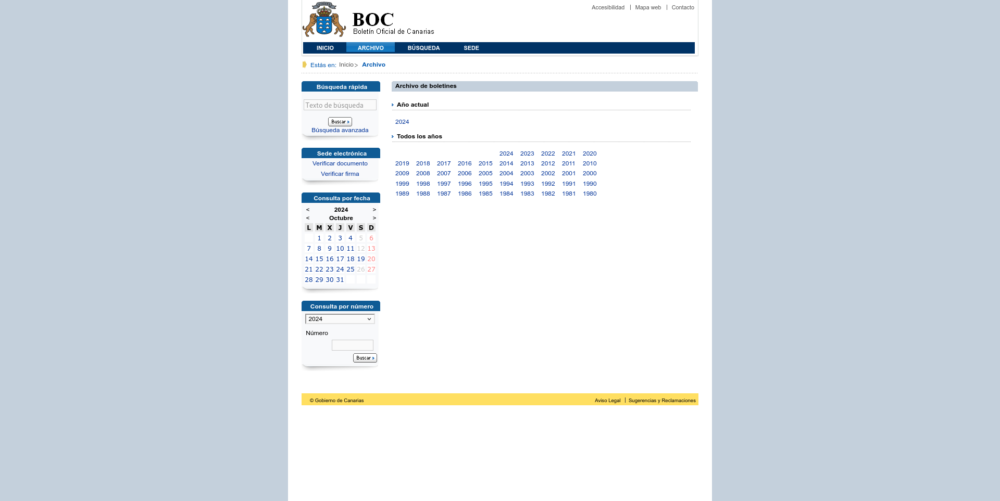

# Boc·ajarro

## Documentación

### Descarga de archivos

El [Boletín Oficial de Canarias](https://www.gobiernodecanarias.org/boc/) tiene una página, llamada el [Archivo de boletines](https://www.gobiernodecanarias.org/boc/archivo/), que contiene enlaces a cada uno de los años en los que se ha publicado algún boletín.



El trabajo [DownloadArchive](../app/Jobs/Boc/DownloadArchive.php) se encarga de descargar esta página y guardar su contenido sin procesar en la tabla `page`. Los datos que se guardan son:

- `id` identificador único de la descarga.
- `name` nombre del recurso descargado (en este caso: **Archive**).
- `url` dirección en la que se encontró el contenido descargado.
- `content` el contenido (HTML) descargado.
- `created_at` la fecha y hora en la que se realizó la descarga.

Este proceso puede ejecutarse manualmente lanzando:

```php
App\Jobs\Boc\DownloadArchive::dispatch()->handle();
```

#### Comprobación de unicidad

Páginas como el archivo no cambian a menudo por lo que es de esperar que muchas de las veces que la descarguemos, obtengamos los mismos datos.

Para mantener controlado el tamaño de la base de datos, durante la descarga de páginas se comprueba si el contenido descargado es idéntico al último y, de ser así, vincula ambas descargas dejando vacío el campo contenido de la nueva.

> [!NOTE]
> El vínculo entre dos registros se hace únicamente si son contiguos. Es decir, si no hay más registros del mismo tipo entre medias con diferente contenido.

El campo que se utiliza para el vínculo es:

- `shared_content_with_page_id` que contiene el identificador de la siguiente descarga del mismo tipo en la que se encontró el mismo contenido.

### Extracción de enlaces

Una vez descargada la página que contiene la lista de años para los que se han publicado boletines, obtenemos la lista con esos enlaces.

El trabajo [ExtractLinksFromArchive](../app/Jobs/Boc/ExtractLinksFromArchive.php) se encarga de leer un registro de la tabla `page`, comprobar que se trata de una descarga del archivo de boletines y, si es así, extraer sus enlaces a las páginas anuales.

Los enlaces descargados se guardan en la tabla `link`, donde se guardan estos campos:

- `id` identificador único del enlace.
- `type` tipo de enlace.
- `page_id` identificador de la página en la que se encontró el enlace.
- `url` enlace en versión absoluta.
- `created_at` fecha y hora a la que se procesó el enlace.

El tipo de enlace puede tener uno de estos valores:

1. `Root`: raíz del sitio web del Boletín Oficial de Canarias.
2. `Robots`: fichero robots.txt con detalle de páginas bloqueadas para buscadores.
3. `Archive`: artchivo de boletines anuales publicados.
4. `YearIndex`: índices de cada uno de los boletines publicados cada año.
5. `BulletinIndex`: índece con el contenido de cada uno de los boletines.
6. `BulletinArticle`: artículos publicados.

### Seguimiento de enlaces

Los enlaces extraídos del archivo de boletines, contienen enlaces a los índices anuales de boletines. De seguir esos enlaces y programar las siguientes descargas, se encarga el trabajo [FollowLinksFoundInArchive](../app/Jobs/Boc/FollowLinksFoundInArchive.php).

A cada uno de estos enlaces le corresponde un [índice anual](2-year-index.md).
