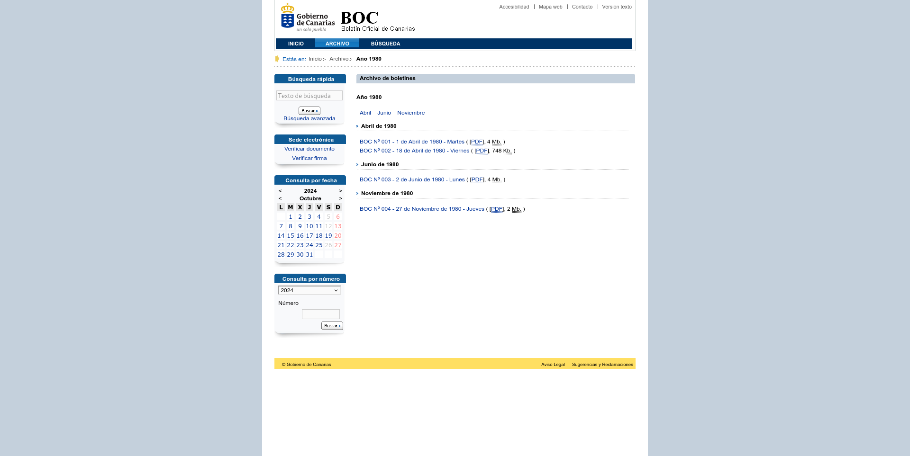

# Boc·ajarro

## Documentación

### Descarga de índices anuales

Para cada año en que se ha publicado algún boletín, hay un índice con cada uno de los boletines publicados ese año. El índice empieza en [1980](https://www.gobiernodecanarias.org/boc/archivo/1980/), cuando solo se publicaron cuatro boletines.



El trabajo [DownloadYearIndex](../app/Jobs/Boc/DownloadYearIndex.php) se encarga de descargar el contenido de esos índices y guardarlo sin procesar (también en la tabla `page`). Si durante la descarga encuentra contenido nuevo, dispara la correspondiente extracción de enlaces.

Este proceso puede ejecutarse manualmente lanzando:

```php
App\Jobs\Boc\DownloadYearIndex::dispatch(1980)->handle();
```

#### Extracción de enlaces

El trabajo [ExtractLinksFromYearIndex](../app/Jobs/Boc/ExtractLinksFromYearIndex.php) se encarga de analizar las páginas de índices anuales descargadas y extraer de ellas los enlaces a boletines que contengan.
